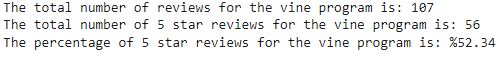
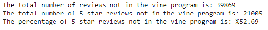

# Amazon_Vine_Analysis
## Overview
This report looks at amazon reviewers data to distinguish if there is any positive bias among the vine program reviewers for a given dataset. The vine program is a service that allows manufacturers and publishers to pay people to try and then review their products. We chose to look at the outdoors items reviewers to see if the number of vine program versus non vine program had any bias in five star reviews.

## Resources
Data: [Amazon Reviews](https://s3.amazonaws.com/amazon-reviews-pds/tsv/index.txt), specifically the [Outdoor Review](https://s3.amazonaws.com/amazon-reviews-pds/tsv/amazon_reviews_us_Outdoors_v1_00.tsv.gz)  
Resources: Visual Studio Code 1.71.2, pgAdmin4 6.8, Postgres SQL 11, google colab, python, pyspark, Amazon Web Services Relational Database System and S3 Buckets

## Results
Below are two tables showing the results from amazon reviews of outdoor items broken down by vine program participants (Table 1) and non vine program participants (Table 2)

> Table 1. Vine Program Participants

> Table 2. Participants not in vine program

In conclusion:
- There are way more non vine program reviewers as opposed to vine program reviewers: 39869 vs 107
- There are also way more five star reviews from non vine reviewers: 21005 vs 56
- However, the percentages of five star reviews is fairly consistant. Non Vine: %52.69 vs Vine: %52.34.

## Summary
So is there a bias? Based on the results section above, I would say there is not bias in five star reviews for participants in the vine program. The difference in percentage of five star reviews between vine program reviewers and non vine program reviewers is less than half a percent even with large differences in total reviewers and five star reviews. Based on the outdoors items, vine program reviewers seem to have no positive bias towards products they are paid to review. 

Additionally, we could look at the distribution of rankings (on a scale from one to five) to show how vine program reviewers rate products that are not only five stars compared to non vine program reviewers. This way we can equalize the vast difference in number of reviewers to provide a more balance analytical approach. Based on the five star reviews being fairly similar, I would guess there would be similarities in ratings across the board.

